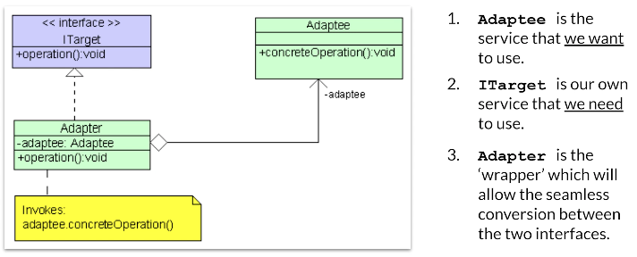
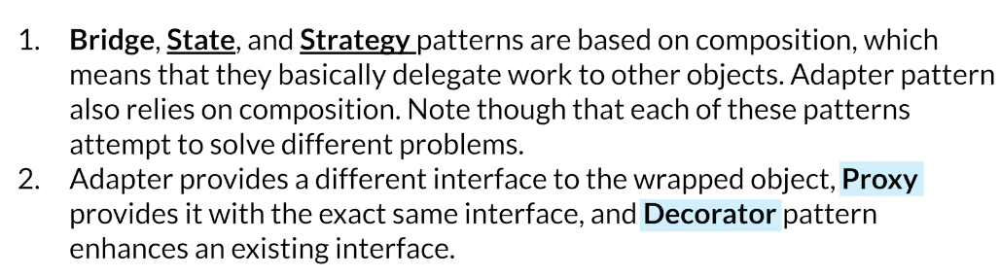
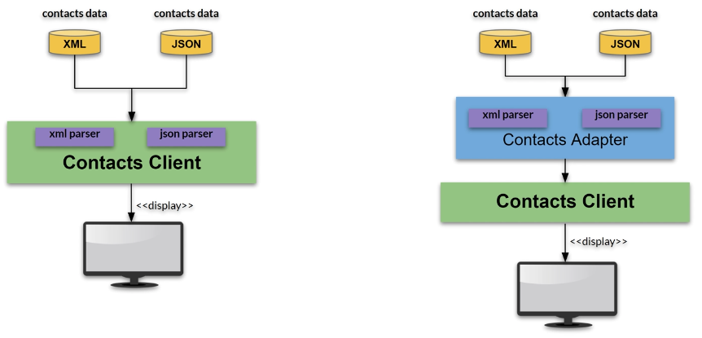
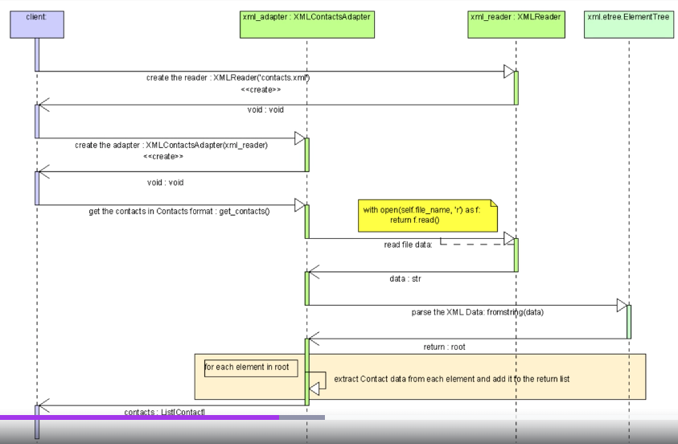
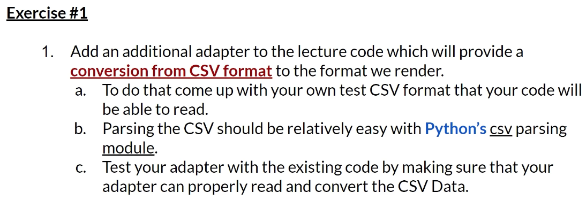
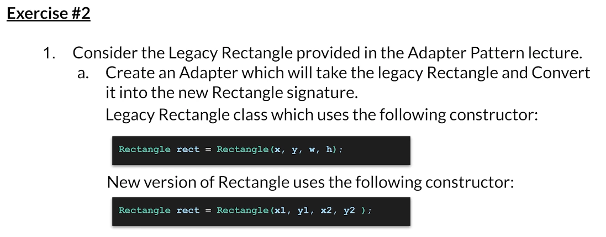

# Adapter Design Pattern

## UML Diagram

# Contacts Adapter

## Bad vs. Good Architecture

- Contacts client não deveria saber NADA sobre XML ou JSON

### UML Diagram

# Exercises

- x,y são lower left corner do retângulo