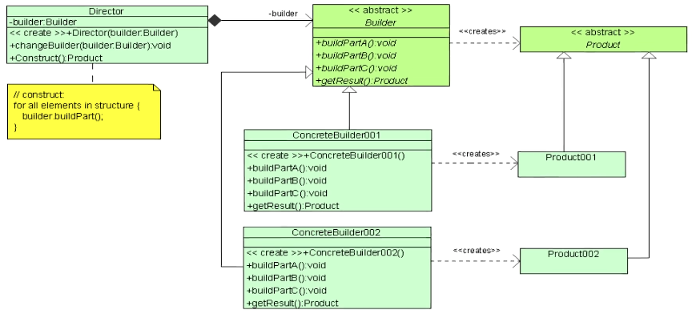
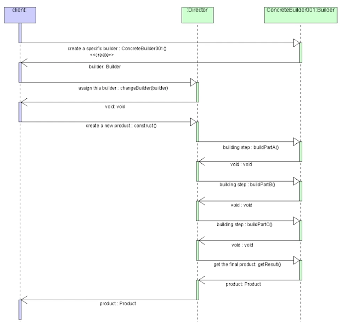
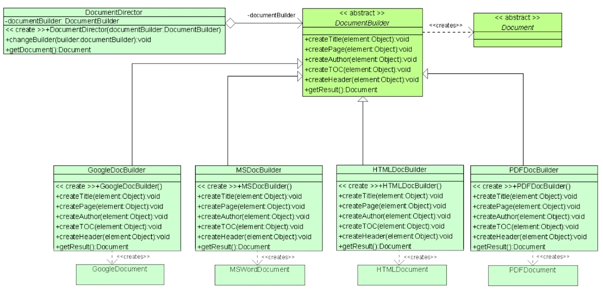

# Builder Design Pattern 

## UML Diagram

## Sequence Diagram

- client conhece o produto -> usa para inicializar o Director
- Há uma sequência prédefinida de steps (Director -> Builder), mas Director desconhece Product
    - Se for necessária uma lógica especial para um Product, deve ser codada no Director
- Todos os Builders devem implementar os mesmos steps 
    - Se um Builder não precisa de um deles: vazio (pass)

## Document Builder UML Diagram

