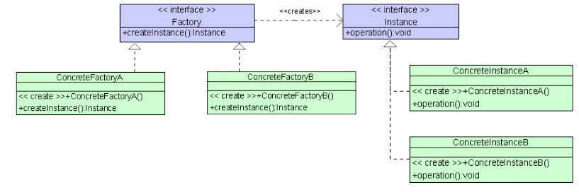
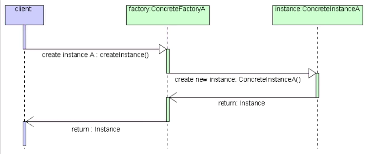
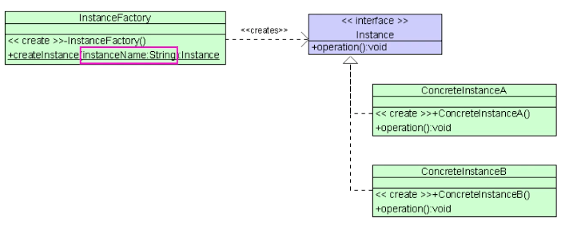
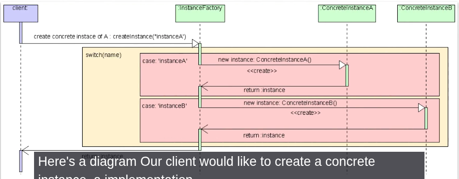
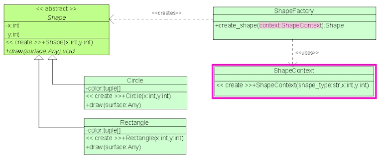
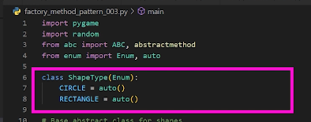
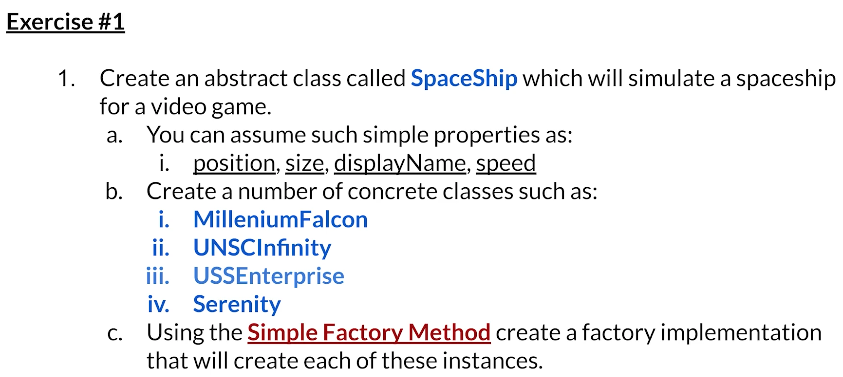
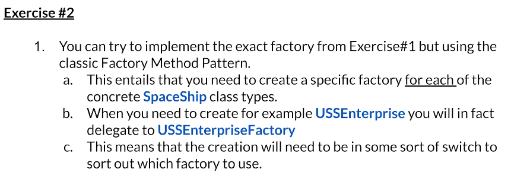

# Factory Method (FM) Pattern

## 1st Variant: The classic of original GoF FM

- Para cada tipo de objeto concreto precisamos de uma implementação concentra de uma FM para o criar!
- Aqui temos uma interface para a factory

## 2nd Variant: The simple method variand - Parameterized FM

- GRANDE DIFERENCA: Aqui NÃO temos uma interface para a factory
- 1 Factory - Multiple instances
    - Private constructor: Não podemos instanciar a factory
    - Static method: create instance (recebe um parâmetro que pode ser qualquer coisa)

### Improvement

- Jeito melhor de pssar dados para um FM: Permite + flexibilidade
- Context class: Agrega dados necessários para criar objeto. Usa como input para o método de criação

- Maneira de resolver o problema do if else com strings: ENUMERATION!!

# Exercises

