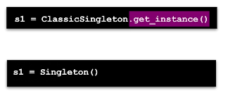
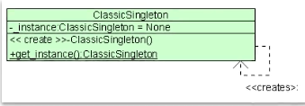
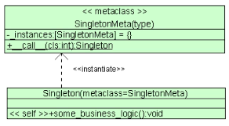
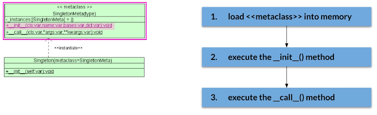
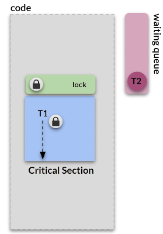

# Singleton

- get_instance() vs constructor:

1. Consistencia de uso
2. Flexibilidade para logica de inicializacao (facil modificar)
3. Facilita expandir codigo de setup e inicializacao
4. Flow melhot pq nome eh uniforme across class names

O get_instance eh um indicativo de que se trata de um singleton

## Classic GoF Implementation

- LAZY INSTANTIATION
- Private static instance variable inicializada com None
- Construtor privado que nao pode ser chamado: Remove habilidade do caller criar mais objetos atraves do construtor
- get_instance: static method - controla processo de criacao
- CHAVE: Lancar erro no init

## Simple Python Implementation

- LAZY INSTANTIATION
- Nao controlamos o constructor
- Temos a static variable da instancia e o construtor
- Sobrescrevemos o new method

## Metaclass

- metaclasse em Python: define comportamento e regras para a criacao de outras classes
- Por default, todas as classes herdam implicitamente da metaclasse `type`
- Permitem customizar o processo de criacao

### Implementation
- A logica para tornar a classe um singleton esta definida na metaclasse
- _instances [dict] guarda a single instance the cada subclasse
- Sempre que criarmos instancias da classe filha, o gerenciamento sera feito pelo call method sobrescrito da metaclass (garente que apenas 1 instancia exista)

### Eager loading
- Permite data preload e caching
- Permite pre-caching de conectividade
- Importante p/ acesso frequente que precisa ser rapido
- Inicializamos e carregamos a instancia antes de precisar dela
- Possivei atraves das metaclasses - sobrescrever init method

## Thread Safety

- Mulitple threads = Race conditions
- Nem sempre eh necessario criar o singleto thread safe.
- Critical section = Area do codigo em que threads multiplas podem gerar comportamento imprevisivel -> Dado final depende do tempo de execucao
- Determinar critical section eh complicado.  Geralmente envolve escrita de dados.

- Race condition = threads competindo para mudar algo nos dados
- Para previnir: LOCK MECHANISM

